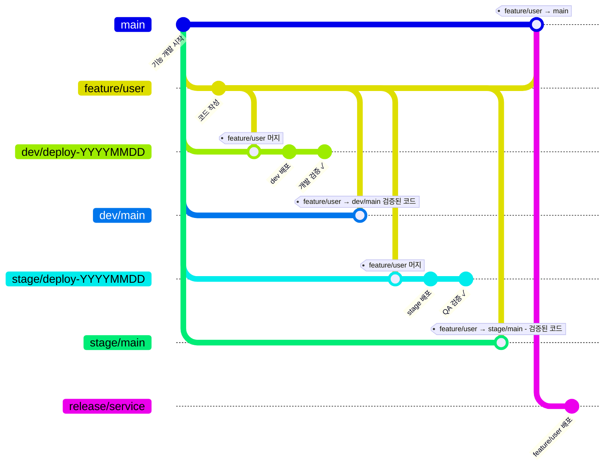
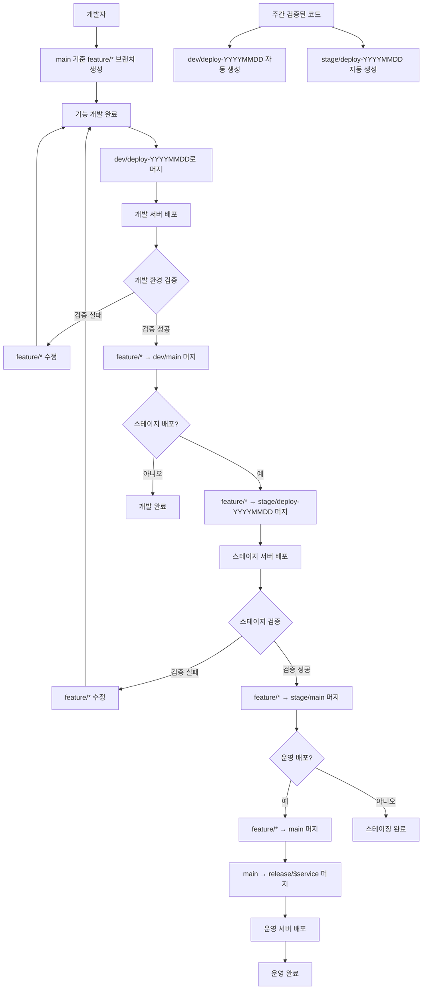

# Spring Sample 프로젝트

Spring WebFlux와 R2DBC를 사용한 리액티브 웹 애플리케이션 템플릿입니다.

# 목차
- [주요 기능](#주요-기능)
- [기술 스택](#기술-스택)
- [코드 스타일](#코드-스타일)
- [GIT 배포 전략](#git-배포-전략)

## 주요 기능
- 비동기 논블로킹 웹 애플리케이션
- 리액티브 데이터베이스 연동 (R2DBC)
- 멀티모듈 프로젝트 구조
- Spring Boot 3.4.5 기반

## 기술 스택
- Java 21 이상
- Gradle 8.5 이상
- MySQL 8.0.36 이상

### Backend
- **Java 21**
- **Spring Boot 3.4.5**
- **Spring WebFlux** - 리액티브 웹 프레임워크
- **Spring Data R2DBC** - 리액티브 데이터베이스 연동
- **MySQL 8.0.36** - 데이터베이스

### Build Tool
- **Gradle** - 빌드 및 의존성 관리

### 코드 스타일
- Java 코드 컨벤션은 [Google Java Style Guide](https://google.github.io/styleguide/javaguide.html)를 따릅니다.

### sample-api
- REST API 엔드포인트 정의
- 요청/응답 처리
- 인증 및 권한 관리

## GIT 배포 전략

| 브랜치                       | 용도                  | 생성         | 머지 출처       |
|---------------------------|---------------------|------------|-------------|
| `feature/*`               | 기능 개발               | main 기준    | `feature/*` |
| `dev/deploy-YYYYMMDD`   | 주간 배포, 추후 자동 생성     | dev/main   | `feature/*` |
| `dev/main`                | 개발에서 검증된 코드         | main 기준    | `feature/*` |
| `stage/deploy-YYYYMMDD` | 주간 배포, 추후 자동 생성     | stage/main | `feature/*` |
| `stage/main`              | 스테이지 배포             | main 기준    | `feature/*` |
| `main`                    | 스테이지까지 검증된 운영 배포 코드 | -          | `feature/*` |
| `release/$service`        | 운영에 배포될 코드          | main 기준    | `main`      |

- 대부분의 머지 출처가 `feature/*`인 이유
    - dev 또는 stage에서 검증이 완료되었더라도, 비즈니스 상황에 따라 운영 배포가 보류되는 경우가 발생합니다. 이런 상황에서 해당 feature는 main(운영)으로 머지되어서는 안됩니다.

- `{dev/stage}/deploy-YYYYMMDD` 브랜치가 존재하는 이유
    - 검증 목적으로 stage, dev 환경에 코드를 배포한 후 실제 검증을 진행하지 않거나, 프로젝트가 중단되는 경우가 있습니다. 이로 인해 검증되지 않은 코드가 누적되어 시스템이 불안정해질 수 있으므로, 매주 검증된 코드로 초기화하여 안정성을 보장.

### 배포 흐름도
#### gitGraph

#### flowchart

